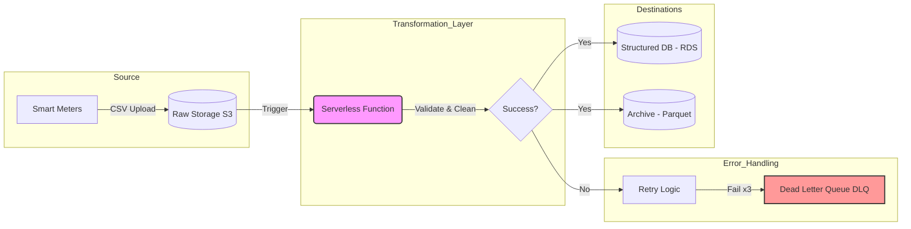

# Lecture-Task-Selected-Topics
Case Study: Serverless ETL Design for Smart-Meter Data

Task A: ETL Architecture Diagram (System Design)

The following conceptual architecture describes a robust, serverless pipeline designed to transform "dark data" into actionable insights.

Source Layer:

Smart meters upload raw CSV files to a Cloud Raw Storage (Landing Zone).

Transformation Layer (Serverless Engine):

An event-driven trigger initiates the process.

Success Path: Data is cleaned, standardized, and validated.

Failure/Retry Path: Automatic retries are triggered upon failure. If all retries fail, the record is moved to a Dead Letter Queue (DLQ) for manual inspection.

Destinations:

Structured Storage (RDS): Holds cleaned data for immediate querying and operational validation.

Analytics-Optimized Archive: Data is converted to Parquet format for high-performance historical analysis.

Task B: Transformation Logic & Business Rules
To resolve the data quality issues , the following business rules are applied during the transformation phase:

Rule 1: Unit Standardization: If the energy unit is "W", divide the value by 1000 and convert it to "kW" to ensure consistency across all 50,000 meters.

Rule 2: Missing Values Handling: If an energy reading is NULL (due to Wi-Fi outages), flag the record and exclude it from peak-usage calculations to maintain data integrity.

Rule 3: Data Validation: Verify that the consumption value is non-negative and the timestamp is logically valid.

Rule 4: Faulty Meter Detection: If a meter reports zero consumption for an unusually long period, mark the record as a "Potential Faulty Meter" for maintenance review.

Task C: Single Record Lifecycle Explanation
The journey of a single smart-meter record through the pipeline follows these steps:

Upload: The record enters the system via a CSV file uploaded to raw storage.

Triggering: The storage event automatically triggers the serverless transformation process.

Cleaning & Validation: The engine applies the business rules (Standardization, NULL handling, and fault detection).

Structured Storage: The validated record is inserted into a relational database (RDS) for immediate access.

Conversion & Archival: The record is eventually transformed into Parquet format—optimizing it for large-scale historical analytics—and moved to the long-term archive.

Error Handling: If the record fails any validation step, it is routed to an error-handling path where retries or manual flagging occurs.
